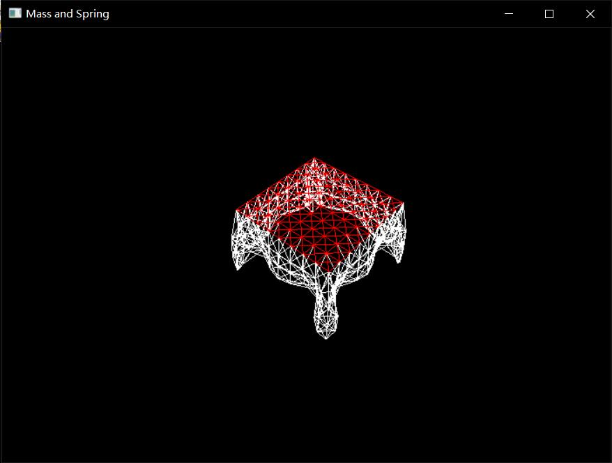
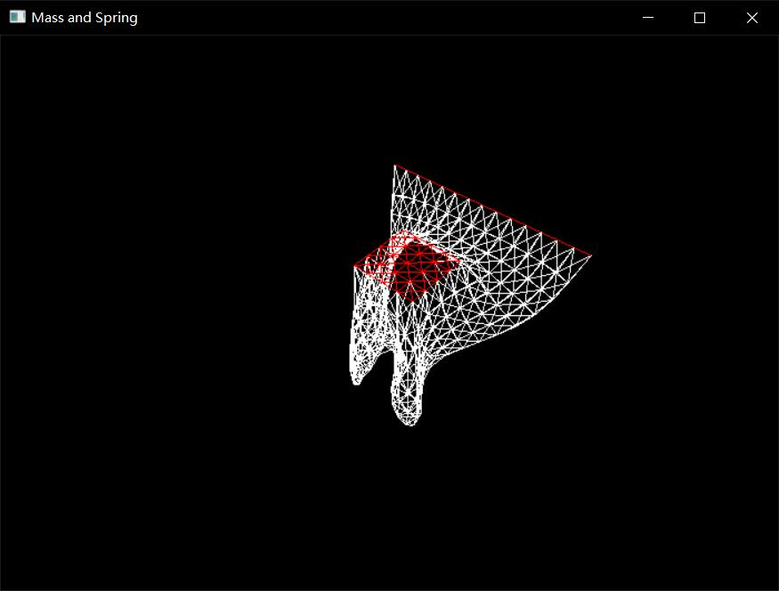

# Mass-and-Spring-System

A mass & spring system implemented by c++. This system can be improved for cloth simulation and it is an easy demo for my project. I use this to implement the optimization procedure to get the quasi-static state.

**env**: dlib c++ && glut && eigen

Optimization Method:
1. Gradient-Descent
2. bfgs by dlib

Integration: Explicit Euler || RK4

Demo:

